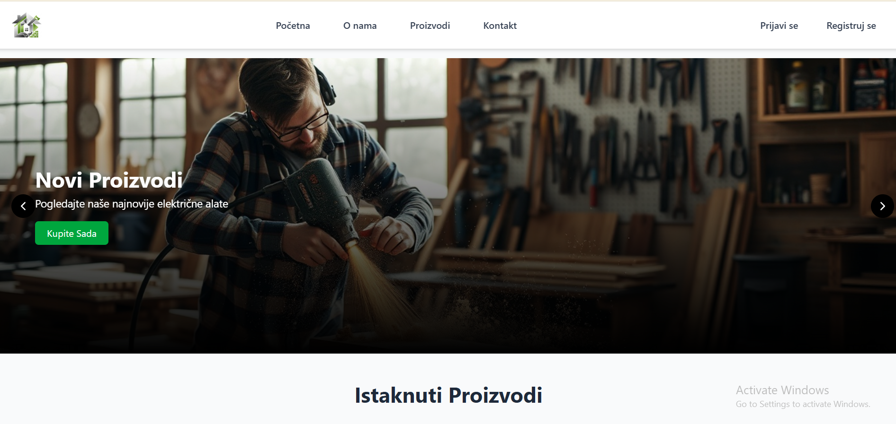
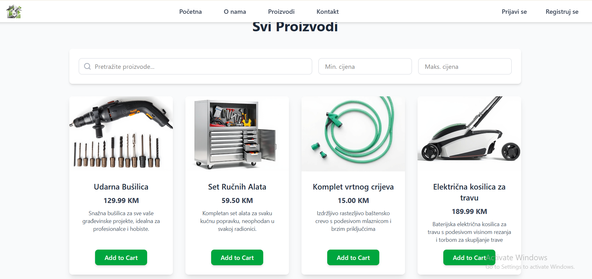
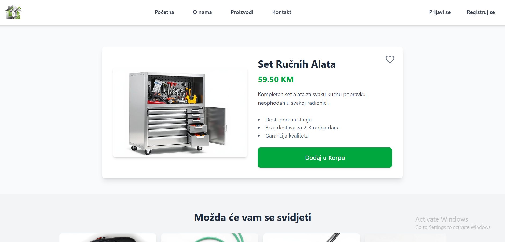
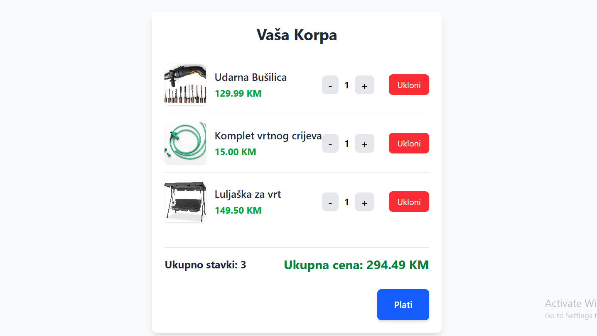
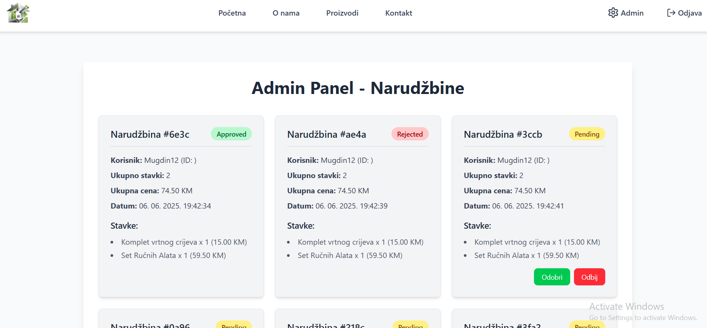

# E-commerce Platforma "Baucenter"

Dobrodošli u repozitorijum e-commerce platforme "Baucenter". Ovaj projekat predstavlja modernu web aplikaciju za online prodaju građevinskih materijala i alata, razvijenu pomoću React-a i simuliranog backend-a.

---

## Kratki opis teme

Ovaj projekat je razvoj osnovne e-commerce platforme korišćenjem React-a za frontend i `json-servera` za simulaciju backend-a. Aplikacija omogućava prikaz i pretragu proizvoda, funkcionalnosti korpe za kupovinu, upravljanje korisnicima (registracija/prijava) i poseduje admin panel za upravljanje narudžbinama i prikaz kontakt formi. Dizajn je moderan, čist i responsivan, sa fokusom na zelene tonove i intuitivno korisničko iskustvo.

---

## Tehnologije Korišćene u Radu

Projekat je izgrađen korišćenjem sledećih modernih web tehnologija:

### Frontend Razvoj:
* **React (sa Hooks):** Glavni framework za izgradnju korisničkog interfejsa, koristeći funkcionalne komponente i React Hooks za upravljanje stanjem i životnim ciklusom komponenti.
* **HTML & JavaScript (ES6+):** Osnovne tehnologije za strukturu i interaktivnost web stranica.
* **Tailwind CSS:** Utility-first CSS framework korišćen za brzu i responsivnu stilizaciju. Omogućava brzu izradu modernog i prilagodljivog dizajna direktno u JSX-u.
* **React Context API:** Koristi se za globalno upravljanje stanjem, specifično za autentifikaciju korisnika (`AuthContext`) i stanje korpe (`CartContext`).
* **React Router DOM:** Za upravljanje rutiranjem unutar aplikacije, omogućavajući navigaciju između različitih stranica bez osvežavanja.
* **`localStorage`:** Koristi se za perzistenciju podataka korpe na klijentskoj strani, osiguravajući da sadržaj korpe ostane sačuvan tokom sesije pregledača (tj., nakon osvežavanja stranice).
* **`lucide-react`:** Biblioteka React komponenti za vektorske ikone, korišćena za navigaciju, akcije i vizuelno obogaćivanje UI-ja.

### Backend Simulacija / API:
* **`json-server`:** Korišćen kao lagani REST API mock server, omogućavajući simulaciju backend operacija (GET, POST, PATCH) za `users`, `products`, `orders` i `contacts` podatke iz `db.json` fajla.

### Alati za Razvoj:
* **Vite:** Brzi build tool za React aplikacije.
* **npm/yarn:** Paket menadžeri za instalaciju i upravljanje zavisnostima projekta.

---

## Opis Strukture Projekta (Mapa Fajlova)

Struktura projekta je organizovana na modularan način radi bolje preglednosti i održivosti koda:
```bash
├── public/
│   └── 
├── src/
│   ├── App.jsx                     # Glavna komponenta aplikacije, sadrži rutiranje
│   ├── main.jsx                    # Ulazna tačka React aplikacije
│   ├── index.css                   # Glavni CSS fajl (Tailwind CSS importi i globalni stilovi)
│   ├── Navbar.jsx                  # Komponenta navigacione trake
│   ├── Footer.jsx                  # Komponenta podnožja stranice
│   ├── Home.jsx                    # Početna stranica
│   ├── Shop.jsx                    # Stranica prodavnice (svi proizvodi)
│   ├── ImageSlider.jsx             # Komponenta za karusel slika na početnoj stranici
│   ├── FeaturedProducts.jsx        # Komponenta za prikaz istaknutih proizvoda
│   ├── Hero.jsx                    # Komponenta za kategorije proizvoda (ispod glavnog slajdera)
│   ├── contexts/
│   │   ├── AuthContext.jsx         # React Context za autentifikaciju korisnika
│   │   └── CartContext.jsx         # React Context za upravljanje korpom (sa localStorage)
│   ├── pages/
│   │   ├── About.jsx               # Stranica "O nama"
│   │   ├── ProductDetail.jsx       # Stranica sa detaljima pojedinačnog proizvoda
│   │   ├── Signin.jsx              # Stranica za prijavu korisnika
│   │   ├── Signup.jsx              # Stranica za registraciju korisnika
│   │   ├── AdminPanel.jsx          # Stranica admin panela (upravlja stanjem narudžbina i proizvoda)
│   │   ├── Cart.jsx                # Stranica za prikaz korpe
│   │   └── ContactForm.jsx         # Stranica za kontakt formu
│   ├── components/
│   │   ├── Card.jsx                # Komponenta za prikaz pojedinačne kartice proizvoda
│   │   ├── ProductFilter.jsx       # Komponenta za filtere proizvoda na stranici prodavnice
│   │   ├── Pagination.jsx          # Komponenta za paginaciju na stranici prodavnice
│   │   ├── AddToCartSuccessModal.jsx # Modalni prozor za potvrdu akcija (npr. dodavanja u korpu)
│   │   ├── WishlistIcon.jsx        # Komponenta ikone za listu želja
│   │   ├── ProductDisplay.jsx      # Komponenta za prikaz detalja proizvoda na ProductDetail stranici
│   │   ├── RelatedProductsCarousel.jsx # Karusel za povezane proizvode
│   │   ├── OrdersDisplay.jsx       # Komponenta za prikaz liste narudžbina u admin panelu
│   └── slike/                      # Statički folder za slike koje su javno dostupne putem URL-a
│       ├── Item1.jpg               # Slike proizvoda
│       ├── Item2.jpg
│       ├── ...
│       ├── 7efs.gif                # GIF za poruku o uspešnom dodavanju
│       ├── slika1.jpg              # Slike za Image Slider/Hero sekciju
│       ├── slika2.jpg
│       └── slika3.jpg
├── db.json                         # Fajl za json-server, sadrži podatke o korisnicima, proizvodima, narudžbinama i kontaktima
├── package.json                    # Konfiguracija projekta i zavisnosti
├── tailwind.config.js              # Konfiguracija Tailwind CSS-a
└── vite.config.js                  # Konfiguracija Vite build tool-a
---
```
## Funkcionalnosti i Opis Dizajna

Aplikacija pruža osnovne e-commerce funkcionalnosti sa čistim i modernim dizajnom.

### Funkcionalnosti:
* **Prikaz Proizvoda:**
    * **Početna stranica (`/`):** Prikazuje klizni karusel slika (`ImageSlider`), istaknute proizvode (`FeaturedProducts`) i kategorije proizvoda (`Hero`).
    * **Stranica prodavnice (`/proizvodi`):** Prikazuje sve dostupne proizvode sa mogućnošću pretrage (`ProductFilter`) po nazivu/opisu i filtriranja po cenovnom rangu. Podržava paginaciju.
    * **Detalji proizvoda (`/proizvodi/:productName`):** Detaljan prikaz pojedinačnog proizvoda (`ProductDisplay`) sa opisom, cenom i dugmetom "Dodaj u Korpu". Prikazuje i karusel povezanih proizvoda.
* **Korpa za Kupovinu:**
    * Dodavanje proizvoda u korpu (direktno iz `Card` i `ProductDisplay` komponenti).
    * Ažuriranje količine proizvoda u korpi.
    * Uklanjanje proizvoda iz korpe.
    * Prikaz ukupnog broja stavki i ukupne cene.
    * **Perzistentnost:** Sadržaj korpe se pamti u `localStorage` tokom sesije pregledača, ali se ne pamti trajno (npr. nakon zatvaranja pregledača).
    * Dugme "Plati" šalje narudžbinu na simulirani backend (`json-server`) i prazni korpu.
* **Upravljanje Korisnicima:**
    * **Registracija (`/registracija`):** Kreiranje novih korisničkih naloga.
    * **Prijava (`/prijavi-se`):** Prijava postojećih korisnika.
    * **Autentifikacija:** Korisnici se autentifikuju preko `json-servera`.
* **Admin Panel (`/admin`):**
    * **Kontrola pristupa:** Samo korisnici sa ulogom "admin" mogu pristupiti panelu. Neautentifikovani ili ne-admin korisnici se preusmeravaju na početnu stranicu.
    * **Pregled narudžbina:** Prikazuje sve pristigle narudžbine sa detaljima kao što su korisnik, stavke, ukupna cena, datum i status.
    * **Promena statusa narudžbine:** Administrator može promeniti status narudžbine (npr. "Pending", "Approved", "Rejected") putem dugmadi.
* **Interaktivni Elementi:**
    * **Lista želja (frontend-only):** Ikona srca na karticama proizvoda koja vizuelno pokazuje dodavanje/uklanjanje iz liste želja (trenutno nema backend perzistenciju).
    * **Modalni prozori:** Prikazuju poruke o uspešnim akcijama (npr. "Proizvod dodan u korpu!" ili "Proizvod uspješno dodan!").
    * **Loading i Error States:** Prikazuju se odgovarajuće poruke tokom učitavanja podataka ili u slučaju greške.

### Opis Dizajna:
Dizajn aplikacije je moderan, čist i funkcionalan, sa fokusom na korisničko iskustvo i responsivnost.

* **Opšta Tema:** Minimalistička i intuitivna, sa dominantnim zelenim tonovima koji naglašavaju svežinu i pouzdanost.
* **Responsivnost:**
    * **Mobilni-prvi pristup:** Layouti su dizajnirani da izgledaju optimalno na svim veličinama ekrana (mobilni, tablet, desktop) zahvaljujući Tailwind CSS-ovim responsivnim klasama (`sm:`, `md:`, `lg:`).
    * **Fleksibilni kontejneri:** Korišćenje Flexbox-a i Grida za dinamičko slaganje elemenata.
    * **Fluidne slike:** Slike se skaliraju automatski kako bi se uklopile u raspoloživi prostor.
    * **Prilagodljiva korpa:** Posebna pažnja posvećena je rasporedu stavki u korpi na malim ekranima, gde se elementi slazu vertikalno kako bi se sprečilo preklapanje.
* **Paleta Boja:**
    * **Primarna (Akcentna): Zelena:** Koristi se za glavne akcione elemente (dugmad "Dodaj u Korpu", navigacione linkove pri prelasku mišem, primarne tastere u admin panelu). Nijanse uključuju `bg-green-600`, `hover:bg-green-700`, `text-green-600`, `bg-[#00a63e]`. Ova boja simbolizuje prirodu, svežinu i rast, što je prikladno za "Baucenter" koncept.
    * **Sekundarna: Plava:** Koristi se za dugme "Plati" (`bg-blue-600`) i ikone društvenih mreža. Plava boja sugeriše pouzdanost, stabilnost i poverenje.
    * **Neutralne: Sive Nijanse:** Širok spektar sivih tonova (`bg-gray-50`, `bg-gray-100`, `bg-gray-200`, `text-gray-600`, `text-gray-700`, `text-gray-800`, `border-gray-200`) čini osnovu dizajna, pružajući čist i neometan izgled pozadine, kartica i teksta.
    * **Upozorenja/Statusi:**
        * **Crvena:** Za poruke o greškama, dugmad "Ukloni" i ikonu srca za listu želja (`text-red-500`, `bg-red-500`, `bg-red-100`).
        * **Žuta:** Za status "Pending" narudžbina (`bg-yellow-200`).
* **Fontovi:**
    * Glavni font koji se koristi je generički `sans-serif` sistem fontova (npr., `-apple-system`, `Segoe UI`, `Roboto`). Ovo osigurava brže učitavanje i konzistentan izgled na različitim operativnim sistemima.
    * *(Napomena: Iako je "Inter" bio pominjan kao preferencija, trenutna implementacija koristi sistemske fontove za telo teksta, što obezbeđuje univerzalnu kompatibilnost bez dodatnih importovanja.)*
* **UI Elementi:**
    * **Zaobljeni uglovi:** Gotovo svi elementi (dugmad, kartice, modali, input polja) imaju zaobljene uglove (`rounded-lg`, `rounded-full`), što doprinosi modernom i prijateljskom izgledu.
    * **Senke:** Elementi poput kartica proizvoda i modalnih prozora imaju suptilne senke (`shadow-md`, `shadow-lg`) koje im daju dubinu i izdvajaju ih iz pozadine.
    * **Hover efekti i tranzicije:** Dugmad i linkovi imaju animirane promene boja i blage transformacije (`hover:scale-`, `transition-colors`, `transition-transform`) prilikom prelaska mišem, poboljšavajući interaktivnost.
    * **Ikone:** Korišćenje `lucide-react` ikona pruža vizuelnu jasnoću i podržava prepoznatljivost funkcionalnosti.

---

## Uloge Korisnika

Na ovoj e-commerce platformi postoje dve glavne uloge korisnika:

* **`guest` (gost):** Ovo je podrazumevana uloga za standardne korisnike koji se registruju ili prijavljuju. Oni mogu pregledati proizvode, dodavati ih u korpu i slati narudžbine.
* **`admin` (administrator):** Ovo je privilegovana uloga. Samo korisnici sa ovom ulogom imaju pristup admin panelu, gde mogu pregledati i menjati status narudžbina, kao i pregled poslatih kontakt formi.

Autentifikacija korisnika se vrši putem `json-servera`.

---

## Kratki Opis Doprinosa Svakog Člana Tima

* **[Mugdin Krnjić]:** Razvoj frontend korisničkog interfejsa (UI).
* Implementacija funkcionalnosti prikaza proizvoda (Početna, Prodavnica, Detalji). 
* Kreiranje komponenti Card i ProductDisplay. 
* Osiguranje responsivnog dizajna za stranice proizvoda.
* Implementacija logike korpe za kupovinu (dodavanje, ažuriranje, uklanjanje, perzistentnost putem localStorage). 
* Razvoj Admin panela (pregled narudžbina, promena statusa.).
* Inicijalno postavljanje projekta (Vite, Tailwind CSS, React Router DOM).
* Održavanje globalnog stanja aplikacije (AuthContext, CartContext). 
* Implementacija interaktivnih UI elemenata (modalni prozori za potvrde, lista želja).
* Logika slanja narudžbina na server. 
* Opšta optimizacija performansi i otklanjanje grešaka.]
* **[Enis Selimović]:** [Postavljanje json-servera, dodavanje kontakt forme i google maps integracija.
* Dodavanje poslatih kontakt formi u `db.json` i prikaz na admin panelu.]
* **[Haris Salčin]:** [Dodavanje prijave i registracije korisnika.]

---

## Upute za Pokretanje Projekta

Pratite ove korake da biste pokrenuli projekat lokalno:

1.  **Klonirajte repozitorijum:**
    ```bash
    git clone https://github.com/Mugdin12/baucentar-dws.git
    cd [NAZIV_VAŠEG_FOLDERA]
    ```

2.  **Instalirajte zavisnosti:**
    Navigirajte do korena projekta i instalirajte potrebne pakete:
    ```bash
    npm install
    # ili yarn install
    ```

3.  **Ažurirajte `db.json` i premestite slike:**
    * Otvorite `db.json` fajl u korenu projekta. Uverite se da sadrži `users`, `products`, `orders` i `contacts` nizove.
    * Svi podaci o proizvodima moraju biti definisani u `db.json` fajlu.
    * Sve slike koje se koriste u aplikaciji (proizvodi, slajder, hero sekcije, GIF-ovi) moraju biti smeštene u `public/slike/` folder. Ažurirajte `imageUrl` putanje u `db.json` tako da koriste relativne putanje iz `public` foldera (npr., `"/slike/Item1.jpg"`).

4.  **Pokrenite JSON Server (Backend simulacija):**
    U novom terminalu, naviigrajte do korena projekta i pokrenite `json-server`:
    ```bash
    npm run json-server 
    ```
    Ovo će pokrenuti API server na `http://localhost:3001`.

5.  **Pokrenite React Aplikaciju (Frontend):**
    U drugom terminalu, naviigrajte do korena projekta i pokrenite React aplikaciju:
    ```bash
    npm run dev
    # ili yarn dev
    ```
    Aplikacija će biti dostupna na `http://localhost:5173` (ili nekom drugom portu, što će biti prikazano u terminalu).

---

## Snimci Ekrana Radne Aplikacije

Evo nekoliko snimaka ekrana koji prikazuju funkcionalnosti aplikacije:

### Početna Stranica



### Stranica Prodavnice



### Detalji Proizvoda



### Korpa za Kupovinu



### Admin Panel 



